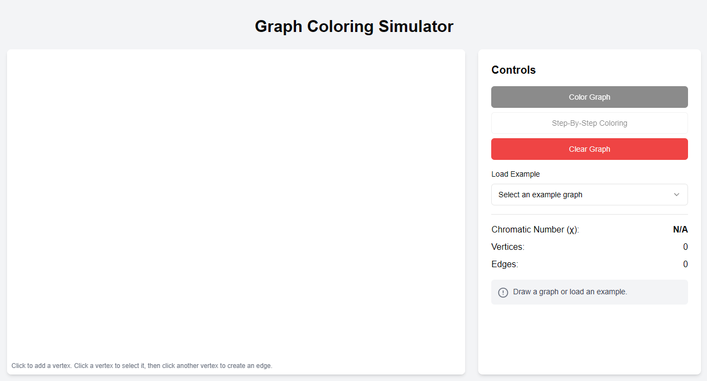
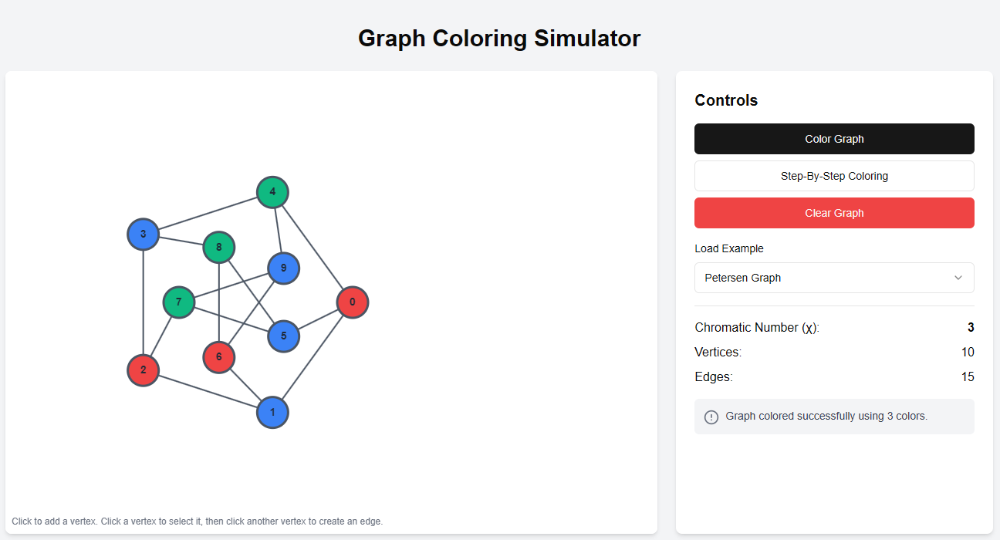

# **Graph Vertex Coloring Simulator**

## Overview
Graph coloring refers to the problem of coloring vertices of a graph in such a way that no two adjacent vertices have the same color. This is also called the vertex coloring problem. If coloring is done using at most m colors, it is called m-coloring.

The minimum number of colors needed to color a graph is called its chromatic number.

The Graph Coloring Simulator is designed to help users understand and experiment with graph vertex coloring algorithm. It provides interactive visualization of the coloring process, allowing for a better grasp of algorithmic steps and efficiency.

## Website
To try out the simulator, visit the project website: 
https://graph-coloring.vercel.app/

## Screenshots

